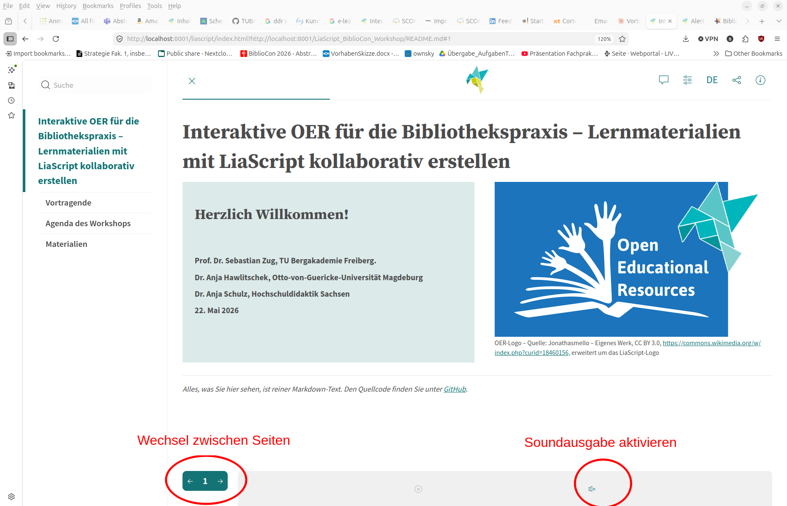

<!--
author:   Sebastian Zug, André Dietrich

email:    sebastian.zug@informatik.tu-freiberg.de

version:  0.1.0

language: de

narrator: Deutsch Male

mode:     Presentation

date:     06/23/2026

comment:  Demo-Modul für den Workshop "Interaktive OER mit LiaScript
          erstellen" an der DHBW (23.06.2026).
          Ein durchgängig interaktives Mini-Modul zur Erkundung.

repository: https://github.com/LiaPlayground/DHBW_Tutorial_2026

attribute: LiaScript in der Lehre
           von Sebastian Zug und André Dietrich
           ist lizenziert unter [CC BY-SA 4.0](https://creativecommons.org/licenses/by-sa/4.0/)

import:   https://github.com/LiaTemplates/Pyodide

link:     style.css

-->

[](https://liascript.github.io/course/?https://raw.githubusercontent.com/LiaPlayground/DHBW_Tutorial_2026/main/01_Erleben.md)

# LiaScript in der Lehre

> <h2>Phase 1 des Workshops "Interaktive OER mit LiaScript erstellen"</h2>
>
> <div style="height: 2.5em;"></div>
>
> <h4>Prof. Dr. Sebastian Zug, TU Bergakademie Freiberg</h4>
> <h4>Dr. André Dietrich, TU Bergakademie Freiberg</h4>
>
> <h4>23. Juni 2026 — DHBW</h4>

--------------------------------------------

## Motivation

Dieses Modul ist Ihr **erster(?) Kontakt** mit einem fertigen LiaScript-Kurs. Es enthält drei inhaltliche Miniaturen aus dem Lehr- und OER-Alltag — jede führt ein **Kernfeature** von LiaScript ein:

1. **OER-Metadaten**
2. **Datenkompetenz**
3. **Recherchekompetenz**

> **Aufgabe während der nächsten 20 Minuten**
>
> Gehen Sie die Seiten durch, probieren Sie alle interaktiven Elemente aus und notieren Sie sich vier Dinge:
>
> - Was hat Sie überrascht?
> - Welches Element würden Sie in Ihrer eigenen Lehre einsetzen?
> - Was möchten Sie im Tutorial-Teil unbedingt lernen?
> - Was hat vielleicht anders funktioniert als erwartet?

> [!TIP]
> Klicken Sie rechts unten auf den Pfeil nach rechts, um auf die nächste Seite zu blättern. Alternativ können Sie auch die Pfeiltaste auf Ihrer Tastatur verwenden.

## Bedienung



## Konzept

Die drei Miniaturen sollen einen Eindruck vermitteln, wie LiaScript die Wissensvermittlung unterstützt. Jeder Abschnitt fokussiert dabei einen anderen Aspekt:

| Abschnitt          | Fokus                                                                                          |
| ------------------ | --------------------------------------------------------------------------------------------- |
| OER-Metadaten      | *von abstrakten Definitionen zu multimodalen Inhalten* - Wissensvermittlung ohne Medienbrüche |
| Datenkompetenz     | *von Daten zum Code* - Integrierte Programmierumgebungen                                       |
| Recherchekompetenz | *von Visualisierungen zu Quizzen* - Interaktive Wissensüberprüfung                             |

> [!NOTE]
> **Drei wiederkehrende Bausteine** helfen Ihnen, sich auf den Seiten zu orientieren:
>
> - **Tipp** (💡, gelb hinterlegt) — Definitionen, Begriffsklärungen und Bedienhinweise.
> - **Note** (blau hinterlegt) — Lese-Empfehlungen: *worauf* Sie in diesem Abschnitt achten sollten.
> - **Mini-Aufgabe** — kleine Explorationsaufgaben, mit denen Sie das Gezeigte selbst ausprobieren; oft folgt eine ausklappbare Auflösung.
>
> **Bitte scrollen Sie auf jeder Seite bis ganz nach unten** — wichtige Inhalte (Beispiele, Code, Aufgaben, Lösungen) stehen oft *unterhalb* des sichtbaren Bereichs.

## 1. OER-Metadaten

> [!TIP]
> **Definition** Metadaten sind beschreibende Daten *über* ein Lernmaterial — Titel, Urheber, Lizenz, Schlagwort, Zielgruppe. Erst sie machen eine Open Educational Resource im Netz *auffindbar*, *zitierbar* und *nachnutzbar*. Aber wie genau werden diese Daten strukturiert, damit sie von Menschen und Maschinen — etwa von OER-Repositorien wie OERSI — verstanden werden? Und wie sieht das in der Praxis aus?

> [!NOTE]
> **Worauf Sie in diesem Abschnitt achten sollten:** Sie begegnen demselben Sachverhalt in *mehreren Darstellungen* — einem erklärenden Video und konkreten Metadaten-Beispielen als Code. Alle liegen auf *dieser* Seite. Das ist gemeint, wenn LiaScript verspricht, *Wissensvermittlung ohne Medienbrüche* zu ermöglichen: keine Tab-Wechsel, keine Tool-Sprünge, kein Kontextverlust.

### Einstieg per Video

Bevor wir in die Details gehen, ein kurzer Überblick zum Thema:

> [!NOTE]
> Sie müssen das Video nicht komplett anschauen — es dient als Einstieg und zur Illustration.

!?[kurzerklärt: Was sind Metadaten?](https://www.youtube.com/watch?v=3zoiYLneVp4)

### Abstraktion und Strukturierung

Offenbar ist es nicht genug, einfach nur Label für Titel, Urheber und Lizenz zu definieren. Es braucht eine Systematik, damit die Daten von verschiedenen Repositorien und Suchportalen in derselben Weise interpretiert werden können.

Welche Felder ein OER-Datensatz haben sollte, legen Metadatenprofile fest — etwa das **LOM-Profil für Hochschul-OER** der [DINI-AG-KIM](https://dini-ag-kim.github.io/hs-oer-lom-profil/latest/), das mehrere deutsche Hochschul-Repositorien gemeinsam pflegen. Statt die Spezifikation durchzulesen, prüfen wir das lieber am konkreten Fall.

> **Mini-Aufgabe:** Stellen Sie sich vor, eine Kollegin möchte dieses Material in ihrer Lehre **nachnutzen und anpassen**. Ist die Beschreibung dafür *vollständig* — oder fehlt eine entscheidende Kategorie?

```xml
<lom>
  <general>
    <title><langstring>LiaScript in der Lehre</langstring></title>
    <language>de</language>
  </general>

  <lifecycle>
    <version><langstring>0.1.0</langstring></version>
    <contribute>
      <role><value>author</value></role>
      <centity><vcard>Sebastian Zug</vcard></centity>
      <date><datetime>2026-06-23</datetime></date>
    </contribute>
    <contribute>
      <role><value>author</value></role>
      <centity><vcard>André Dietrich</vcard></centity>
    </contribute>
  </lifecycle>
</lom>
```

### Lösung

> **Auflösung:** Es fehlt die **Rights-Kategorie** — also die Lizenzangabe. 

`General` (Titel, Sprache) und `Lifecycle` (Version, Autoren, Datum) sind da, aber es gibt kein `<rights>`-Element. Ohne eine ausdrückliche offene Lizenz (z. B. `https://creativecommons.org/licenses/by-sa/4.0/`) ist *rechtlich unklar*, ob das Material überhaupt bearbeitet oder weitergegeben werden darf. 

> **Warum das wichtig ist:** „Frei zugänglich im Netz" und „offen lizenziert" sind zwei verschiedene Dinge. Ein Material ohne Lizenzangabe gilt urheberrechtlich als *„alle Rechte vorbehalten"* — auffindbar, aber nicht nachnutzbar. Die Rights-Kategorie ist deshalb das Feld, das eine OER überhaupt erst zur OER macht.

```xml
<lom>
  <general>
    ...
  </general>

  <lifecycle>
     ...
  </lifecycle>

  <rights>
    <copyrightandotherrestrictions>
      <value>yes</value>
    </copyrightandotherrestrictions>
    <description>
      <langstring xml:lang="x-t-cc-url">https://creativecommons.org/licenses/by-sa/4.0/</langstring>
    </description>
  </rights>
</lom>
```

> [!TIP]
> LiaScript erzeugt sie aus dem Kommentarblock ganz oben in der Markdown-Quelle (`author`, `email`, `attribute` …). Klicken Sie rechts oben in der Ecke auf das **i-Icon** (ℹ️) — dort sehen Sie genau die Angaben aus dem Beispiel oben in einer übersichtlichen Darstellung.

## 2. Datenkompetenz

> [!TIP]
> ... (engl. Data Literacy) ist die Fähigkeit, Daten auf kritische Art und Weise zu sammeln, zu verwalten, zu bewerten, zu analysieren und zu interpretieren. Sie umfasst zudem die Fähigkeit, mit Daten zu kommunizieren und sie zu nutzen, um fundierte Entscheidungen zu treffen.
>
> *(Heidrich, Bauer & Krupka 2018, „Future Skills: Ansätze zur Vermittlung von Data Literacy in der Hochschulbildung", Hochschulforum Digitalisierung, Arbeitspapier 37)*

> [!NOTE]
> **Worauf Sie in diesem Abschnitt achten sollten:** Der Abschnitt zeigt, wie LiaScript die Integration von Code und Daten in Lernmaterialien ermöglicht — und damit die Entwicklung von Datenkompetenz unterstützt.

### Übungsabgaben als interaktives Diagramm

Verschaffen wir uns zunächst einen Überblick - ein fiktives Beispiel aus einer Lehrveranstaltung, das pro Übungswoche die Zahl der abgegebenen und der bestandenen Übungsblätter zeigt. Nutzen Sie die Stapel am rechten Spaltenrand um die Daten zu sortieren und

+ bestimmen Sie, in welcher Woche am meisten Aufgaben abgegeben wurden
+ in welcher Woche die Bestehensquote am höchsten war.

> [!TIP]
> Statt die Zahlen manuell zu erfassen, klicken Sie auf den Button Balkendiagramm über der Tabelle, um die Daten visuell zu erkunden.

<!-- data-type="scatterplot" -->
| Woche | Abgaben | Bestanden |
| ----- | -------:| ---------:|
| KW 1  |     124 |        95 |
| KW 2  |     118 |       102 |
| KW 3  |     132 |       110 |
| KW 4  |     108 |        96 |
| KW 5  |      97 |        88 |
| KW 6  |      91 |        85 |


### Darf es ein bisschen Code sein?

> [!TIP]
> Manchmal reicht es nicht, Daten zu visualisieren - wir wollen auch Kennzahlen berechnen, um die Daten zu interpretieren. In diesem Beispiel wollen wir die Bestehensquote berechnen - also den Anteil der bestandenen an den abgegebenen Übungsblättern pro Woche.
>
> Wir haben Ihnen den Code schon vorgegeben — führen Sie ihn zunächst über den **Ausführen-Button** (`</>`, unten links am Code-Block) aus. Anschließend aktivieren Sie die Berechnung der Bestehensquote: In Zeile 14 beginnt die Anweisung mit einem `#`-Zeichen (Python-Kommentar). Löschen Sie genau dieses eine `#` direkt vor `daten[...]` und führen Sie den Code erneut aus.

```python        python_example.py
import pandas as pd

# hier werden die Daten als DataFrame angelegt - eine tabellarische
# Datenstruktur, die in Python häufig verwendet wird
daten = pd.DataFrame({
    "Woche":     ["KW 1", "KW 2", "KW 3", "KW 4", "KW 5", "KW 6"],
    "Abgaben":   [   124,    118,    132,    108,     97,     91],
    "Bestanden": [    95,    102,    110,     96,     88,     85]
})

# Berechne die Bestehensquote als neue Spalte.
# Entfernen Sie in der nächsten Zeile das führende '# ' (Raute + Leerzeichen),
# damit Python die Zeile nicht mehr als Kommentar überspringt:
# daten["Bestehensquote"] = daten["Bestanden"] / daten["Abgaben"]
print(daten)
```
@Pyodide.eval

## 3. Recherchekompetenz — Boole'sche Operatoren

> [!TIP]
> Wer offene Materialien nachnutzen will, muss sie erst einmal finden — und gezielte Recherche in OER-Portalen ist gar nicht so trivial. Wir machen es hier konkret: Sie bekommen einen überschaubaren Datenbestand, und der Klick auf ein Venn-Diagramm zeigt, welche Treffer eine Boole'sche Anfrage tatsächlich liefert.

### Ein Mini-Datenbestand

Stellen Sie sich vor, ein OER-Suchportal hätte nur die folgenden zehn Treffer zu Ihrer Recherche. Jedes Material ist mit keinem, einem oder beiden der Schlagworte **Open Educational Resources (OER)** bzw. **Berufliche Bildung (BB)** verknüpft.

| #   | Titel                                                       | OER | BB  |
| ---:| ----------------------------------------------------------- |:---:|:---:|
|  1  | *Offene Lizenzen verstehen — eine Einführung in CC*         |  ✓  |     |
|  2  | *OER finden und nachnutzen mit OERSI*                       |  ✓  |     |
|  3  | *Interaktive Lehrmaterialien mit LiaScript erstellen*       |  ✓  |     |
|  4  | *Open Educational Resources in der Hochschullehre*          |  ✓  |     |
|  5  | *Offene Lernmaterialien für die überbetriebliche Ausbildung*|  ✓  |  ✓  |
|  6  | *OER im dualen Berufsausbildungssystem einsetzen*           |  ✓  |  ✓  |
|  7  | *Freie Bildungsmaterialien für die berufliche Weiterbildung*|  ✓  |  ✓  |
|  8  | *Curriculumentwicklung in der Berufsausbildung*             |     |  ✓  |
|  9  | *Duale Berufsausbildung im Wandel*                          |     |  ✓  |
| 10  | *Qualitätsstandards in der beruflichen Bildung*             |     |  ✓  |

> Recherchekompetenz bedeutet hier, die Schlagworte so zu kombinieren, dass spezifische Treffermengen bereitgestellt werden. Die drei wichtigsten Operatoren sind `AND`, `OR` und `NOT` — sie entsprechen den Schnitt-, Vereinigungs- und Differenzmengen in der Mengenlehre.

<!-- data-type="none" -->
| Operator | Bedeutung                           | Wirkung auf Treffermenge | Im Datensatz oben   |
|:--------:| ----------------------------------- |:------------------------:|:--------------------|
|  `AND`   | **Beide** Begriffe müssen vorkommen | verkleinert              | 3 Treffer (5, 6, 7) |
|  `OR`    | **Mindestens einer** muss vorkommen | vergrößert               | 10 Treffer (alle)   |
|  `NOT`   | Begriff **darf nicht** vorkommen    | verkleinert              | 4 bzw. 3 Treffer    |

> Kleiner Merksatz: **AND ist streng, OR ist großzügig, NOT ist wählerisch.**

### Venn-Diagramm zum Datensatz

Das Diagramm visualisiert, wie sich die zehn Titel auf die drei Schnittbereiche verteilen:

<svg class="boole-venn" viewBox="0 0 440 270" xmlns="http://www.w3.org/2000/svg" style="max-width: 620px; display: block; margin: 0 auto;">
  <defs>
    <mask id="notB">
      <rect width="100%" height="100%" fill="white"/>
      <circle cx="260" cy="140" r="85" fill="black"/>
    </mask>
    <mask id="notA">
      <rect width="100%" height="100%" fill="white"/>
      <circle cx="180" cy="140" r="85" fill="black"/>
    </mask>
    <clipPath id="inA">
      <circle cx="180" cy="140" r="85"/>
    </clipPath>
  </defs>

  <text x="110" y="35" text-anchor="middle" font-size="13" fill="#2c3e50" font-weight="bold">Open Educational Resources</text>
  <text x="330" y="35" text-anchor="middle" font-size="13" fill="#2c3e50" font-weight="bold">Berufliche Bildung</text>

  <circle cx="180" cy="140" r="85" fill="#3498db" fill-opacity="0.5" mask="url(#notB)"/>
  <circle cx="260" cy="140" r="85" fill="#9b59b6" fill-opacity="0.7" clip-path="url(#inA)"/>
  <circle cx="260" cy="140" r="85" fill="#e74c3c" fill-opacity="0.5" mask="url(#notA)"/>

  <circle cx="180" cy="140" r="85" fill="none" stroke="#2c3e50" stroke-width="2" pointer-events="none"/>
  <circle cx="260" cy="140" r="85" fill="none" stroke="#2c3e50" stroke-width="2" pointer-events="none"/>

  <text x="115" y="145" text-anchor="middle" font-size="13" font-weight="bold" fill="#1a5490" pointer-events="none">OER NOT BB</text>
  <text x="220" y="145" text-anchor="middle" font-size="13" font-weight="bold" fill="#5b2c6f" pointer-events="none">OER AND BB</text>
  <text x="325" y="145" text-anchor="middle" font-size="13" font-weight="bold" fill="#922b21" pointer-events="none">BB NOT OER</text>

  <text x="220" y="255" text-anchor="middle" font-size="12" fill="#7f8c8d" pointer-events="none">OER OR BB = alle drei Bereiche zusammen</text>
</svg>

> [!TIP]
> Die folgenden Aufgaben prüfen Ihr Verständnis am gleichen Datensatz — und zeigen gleichzeitig drei verschiedene LiaScript-Quizformate: **Einfachauswahl**, **Zahleneingabe** und **Mehrfachauswahl**. Jede Aufgabe hat einen ausklappbaren Hinweis (💡) und eine einklappbare Lösung.

**Aufgabe — Welcher Bereich entspricht welcher Anfrage?** *(Einfachauswahl)*

Welcher Bereich des Venn-Diagramms zeigt Titel, die mit *beiden* Schlagworten verknüpft sind?

- [( )] Der blaue Bereich (links)
- [(X)] Der violette Schnittbereich (Mitte)
- [( )] Der rote Bereich (rechts)
- [( )] Alle drei Bereiche zusammen
- [[?]] Hinweis: "Mit beiden Schlagworten" entspricht der Anfrage `OER AND BB`. AND meint immer den *Schnitt* zweier Mengen.

<details>
<summary><strong>Lösung anzeigen</strong></summary>

Der violette Schnittbereich. Drei Titel haben in der Tabelle beide Häkchen gesetzt:

- 5 · *Offene Lernmaterialien für die überbetriebliche Ausbildung*
- 6 · *OER im dualen Berufsausbildungssystem einsetzen*
- 7 · *Freie Bildungsmaterialien für die berufliche Weiterbildung*

</details>

## Resumee

<h3> Geschafft! </h3>

> Zeit für ein kleines Zwischenfazit: 
> 
> - Was hat Sie überrascht?
> - Welches Element würden Sie in Ihrer eigenen Lehre einsetzen?
> - Was möchten Sie im Tutorial-Teil unbedingt lernen?
> - Was hat vielleicht anders funktioniert als erwartet?