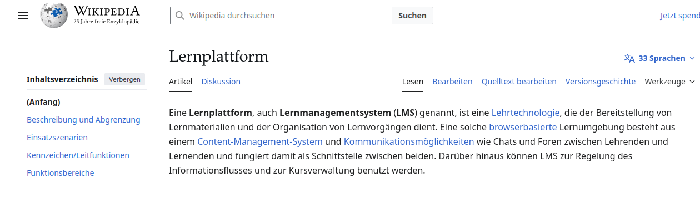

<!--
author:   Sebastian Zug, André Dietrich

email:    sebastian.zug@informatik.tu-freiberg.de

version:  0.1.0

language: de

narrator: Deutsch Male

mode:     Presentation

date:     06/23/2026

comment:  Phase 2 ("Verstehen") des Workshops "Interaktive OER mit LiaScript erstellen" (DHBW, 23.06.2026).
          Idee und Konzepte hinter LiaScript - 15 Minuten.

repository: https://github.com/LiaPlayground/DHBW_Tutorial_2026

import:    https://raw.githubusercontent.com/LiaTemplates/LiveEdit-Embeddings/refs/tags/0.0.1/README.md
           https://raw.githubusercontent.com/LiaTemplates/Chat-Simulation/main/README.md

attribute: "Idee und Konzepte hinter LiaScript"
           von Sebastian Zug und André Dietrich
           ist lizenziert unter [CC BY-SA 4.0](https://creativecommons.org/licenses/by-sa/4.0/)

link:     style.css

-->

[](https://liascript.github.io/course/?https://raw.githubusercontent.com/LiaPlayground/DHBW_Tutorial_2026/main/02_Verstehen.md)

# Idee und Konzepte hinter LiaScript

> <h2>Phase 2 ("Verstehen") des Workshops "Interaktive OER mit LiaScript erstellen"</h2>
>
> <div style="height: 2.5em;"></div>
>
> <h4>Prof. Dr. Sebastian Zug, TU Bergakademie Freiberg</h4>
> <h4>Dr. André Dietrich, TU Bergakademie Freiberg</h4>
>
> <h4>23.06.2026 — DHBW</h4>

--------------------------------------------

## Worum geht es in diesen 15 Minuten?

> [!IMPORTANT]
> Sie haben in [Phase 1 ("Erleben")](https://liascript.github.io/course/?https://raw.githubusercontent.com/LiaPlayground/DHBW_Tutorial_2026/main/01_Erleben.md) einiges davon aus Lernendenperspektive kennengelernt, *was* mit LiaScript möglich ist — Quiz, interaktive Tabellen. In Vorbereitung der eigenen Arbeit damit und weiteren interaktiven Elementen (z. B. Einbindung von ausführbarem Code, eingebettete Diagramme) wollen wir uns aber erst mal die Frage nach dem *Warum* stellen:
>
>- Welches Problem löst LiaScript eigentlich?
>- Warum reicht ein Lernmanagementsystem (Moodle, OPAL, ILIAS) nicht aus?
>- Und was ist der **eine** technische Kern, der alles zusammenhält?

## Ausgangspunkt

>  <!-- Style="color:green" -->__Lehrende möchten motivierende, interaktive Lehr-Lernmaterialien anbieten.__

                  {{1-2}}
********************************************

**Aber in der Praxis ...**

+ Die individuelle Umsetzung ist **aufwändig und zeitintensiv**.
+ Für verschiedene Formate (Text, Video, Quiz, Daten) braucht es **unterschiedliche Werkzeuge** — H5P hier, LearningApps dort, PowerPoint da.
+ Bestehende Inhalte sind **nicht auf das eigene Haus zugeschnitten** — und lassen sich nur schwer anpassen.
+ Materialien aus Moodle/OPAL/ILIAS lassen sich **kaum aus dem System lösen** und in andere Kontexte überführen.

********************************************

{{2}}
```ascii

      Wunsch nach                                            Wunsch nach
  einfacher Umsetzung  -----------> Konflikt <----------- interaktiven Elementen
                                        |                     im Material                                         
                                        |
                                        v
               OER als Lösungsansatz - wir verteilen den Aufwand.
```

### OER als Lösungsansatz — die 5V-Freiheiten

           {{0-1}}
**************************************

Das Konflikt-Paar löst sich auf, wenn Materialien **geteilt, angepasst und weiterentwickelt** werden können — statt jedes Mal bei Null anzufangen. Genau das beschreibt der OER-Gedanke:

>  **Open Educational Resources** ... teaching, learning and
> research materials in any medium, digital or otherwise, that reside in the
> **public domain** or have been released under an open license that permits
> no-cost access, use, **adaptation** and **redistribution** by others.
>
> -- UNESCO 2002 Forum on the Impact of Open Courseware [(Link)](https://unesdoc.unesco.org/ark:/48223/pf0000128515)

**************************************

           {{1}}
**************************************

| 5V-Freiheit                  | Bedeutung                                  |
| ---------------------------- | ------------------------------------------ |
| `verwahren/vervielfältigen ` | Download, Speicherung, Vervielfältigung    |
| `verwenden`                  | Nutzung im Schulungskontext                |
| `verarbeiten`                | Umgestaltung und Adaption                  |
| `vermischen`                 | Kombination und Extraktion                 |
| `verbreiten`                 | (digitale) Publikation                     |


*„5 V-Freiheiten für Offenheit" von Jöran Muuß-Merholz und Jörg Lohrer für [open-educational-resources.de](https://open-educational-resources.de)*

> **Die entscheidende Frage:** In welchem *Format* speichere ich meine Materialien, damit alle fünf V-Freiheiten technisch überhaupt möglich sind?

**************************************

### Warum nicht einfach Wikipedia-Wikitext?

                {{0-1}}
**************************************

Wikipedia zeigt eindrucksvoll, dass kollaborative Inhalte in einem einfachen **Textformat** funktionieren — und genau diese textuelle Quelle ist der Schlüssel zur Nachnutzbarkeit:

```markdown     Ausschnitt aus dem Wikipedia-Artikel "Lernplattform"
Eine '''Lernplattform''', auch '''Lernmanagementsystem''' ('''LMS''') genannt, 
ist eine [[Lehrtechnologie]], die der Bereitstellung von Lernmaterialien und 
der Organisation von Lernvorgängen dient. Eine solche 
[[Webanwendung|browserbasierte]] Lernumgebung besteht aus ...
```



**************************************

                {{1-2}}
**************************************

Für **Lehr-Lernmaterial** hat Wikitext aber entscheidende Schwächen:

+ keine **Interaktivität** (keine Quiz, kein ausführbarer Code, keine Lernstandserfassung),
+ keine **Lernpfad-Strukturen** (Animationen, gestufte Aufdeckung, Selbsttests),
+ keine **Einbettung in Lernmanagementsysteme** (SCORM, xAPI),
+ keine **didaktische Sequenzierung**, das Format ist ein Enzeklopädieartikel, aber kein Kurs.

> **Die Lücke:** Wir brauchen ein Format, das *so einfach wie Wikitext* ist — aber Interaktion, Lernpfade und LMS-Anschluss von Haus aus mitbringt.

**************************************

## LiaScript — die Kernidee in einem Satz

> [!IMPORTANT]
> **LiaScript ist Markdown — erweitert um genau die Elemente, die für interaktive Lehre fehlen.**

Markdown kennen Sie wahrscheinlich schon als Blog-Sprache, Chats oder Obsidian. 

``` javascript @CHAT
[
    {name: "Alice", message: "Wie kann ich wichtige Aspekte in diesem Chat 'betonen'?"},
    {name: "Bob", message: "Nutze einfach `**` vor und nach dem Wort oder Satz, den du hervorheben möchtest!"},
    {name: "Kim", message: "Oder ein Sternchen für kursiv!"},
    {name: "Alice", message: "**Alle mal herhören!**"},
    {name: "Alice", message: "Witzig - drei Sternchen für fett und kursiv: ***Alle mal herhören***!"}
]
```

> LiaScript nimmt diese vertraute Textsprache und ergänzt sie um **drei Kernkonzepte**.

### Konzept 1 — Trennung von Inhalt und Darstellung

> __Alle Inhalte werden als Text beschrieben / Videos und Bilder). Wie es am Ende aussieht, entscheidet der Player — nicht der Autor.__

```markdown @embed.style(height: 600px; min-width: 100%; border: 1px black solid)
# Vom Text zur Darstellung

__Formatierter Text__

Eine zentrale Voraussetzung für den Lernerfolg ist **kognitive Aktivierung**.

Mathematik — einfach in `$...$` setzen.

Die Lernwirksamkeit einer Lehrveranstaltung ist
$L = \frac{\text{lernrelevante Aktivität}}{\text{gesamte Aktivität}}$

__Tabellen__ — wie in Markdown gewohnt:

| Methode          | Lernende mit    |
| -----------------|:---------------:|
| Instruktion      | wenig Vorwissen |
| Konstruktivismus | viel Vorwissen  |

```

> [!NOTE]
> **Warum das für OER zentral ist:** Wer den Quelltext hat, hat alles. Es gibt keine proprietäre Datei, kein Layout, das beim Export verloren geht — der Markdown-Text *ist* das Material.

### Konzept 2 — Interaktion gehört zum Inhalt

> __Quiz, Animationen, Selbsttests sind keine Plugins — sie sind Teil der Auszeichnungssprache selbst.__

In [Phase 1 ("Erleben")](https://liascript.github.io/course/?https://raw.githubusercontent.com/LiaPlayground/DHBW_Tutorial_2026/main/01_Erleben.md) haben Sie bereits das MC-Quiz-Format ausprobiert. Im Quelltext sind das **wenige Zeilen Markdown** — keine Plugin-Installation, keine ID-Vergabe, keine Datenbank.

```markdown @embed.style(height: 600px; min-width: 100%; border: 1px black solid)
# Lehre lebt von Interaktion

__Quiz mit Erklärung__

Welches sind relevante Faktoren, um den Lernerfolg Ihrer Studierenden zu fördern?
- [[ ]]Studierende merken sich Inhalte aus Vorträgen besonders schlecht, besser für den Lernerfolg ist es, wenn sie Dinge tun können.
- [[X]]die Aktivierung des Vorwissens unterstützt Studierende bei der kognitiven Verarbeitung.
- [[X]]je nach Vorwissen benötigen Studierende unterschiedlich viel didaktische Unterstützung.
**************
Sehr gut, Sie haben einen Lernmythos richtig identifiziert!
**************

__Animationsstufen__

Klicken Sie sich durch:

{{1}} Erst kommt diese Zeile,

{{2}} dann diese,

{{3}} und schließlich diese.


__Datenexploration__

Sortieren und Visualisieren

| Studierende | Zufriedenheit | Lernerfolg |
| ------------|:-------------:| ----------:|
| Anna        | 4             | 85%        |
| Ben         | 2             | 40%        | 
| Clara       | 5             | 90%        |
```

> [!NOTE]
> **Vergleich zum LMS-Ansatz:** Ein Moodle-Quiz lebt *in* Moodle. Verlassen Sie das System, ist die Aufgabe weg. Ein LiaScript-Quiz lebt im Markdown-Text — und reist überall mit.

### Konzept 3 — LiaScript kann, was der Browser kann

> __... und das ist heutzutage erstaunlich viel.__

+ **Code ausführen** — Python, JavaScript, C++, R, SQL, ...
+ **Sprachausgabe** — Texte vorlesen lassen (Barrierearmut)
+ **Daten persistieren** — Lernstand im Browser speichern
+ **3D-Modelle, Simulationen, Notenschrift, Schaltkreise**

>[!TIP]
> LiaScript nutzt für die fachspezifischen Erweiterungen ein Plugin-System - man gibt per `import` URLs an, die die eigentliche Funktionalität bereitstellen.

````markdown @embed.style(height: 600px; min-width: 100%; border: 1px black solid)
<!--
import: https://raw.githubusercontent.com/liaTemplates/ABCjs/main/README.md
-->

# Der Browser als Plattform

__Sprachausgabe__ — einfach per Tag:

> {{|> Deutsch Female}}
> Willkommen zur Einführungsveranstaltung!

__Templates__ 

``` abc
X:353
T: GLUECK AUF DER STEIGER KOEMMT
N: E1512
O: Europa, Mitteleuropa, Deutschland
R: Staende -, Bergmanns - Lied
M: 4/4
L: 1/16
K: G
| G8F4A4 | G8z8 | B8A4c4 | B8z4G2A2 | B4B4B4A2B2 | c4A3AA4
A2B2 | c4c4c4B2c2 | d4B3BB4A4 | G8F8 | G4e4d4c2A2 | B8A8 | G8z8
```
@ABCJS.eval
````

## Puh, ... irgendwie viele Befehle?

> Zunächst sieht die Syntax unübersichtlich aus - aber wir haben uns natürlich Gedanken zu einem intuitiven Zugang gemacht.

````markdown @embed.style(height: 600px; min-width: 100%; border: 1px black solid)
# Systematik hinter den Befehlen

__Ein Link__
+ https://tu-freiberg.de/
+ [TUBAF](https://tu-freiberg.de/)

__Ein externes Bild__ (!)
[image](https://tu-freiberg.de/sites/default/files/2024-04/732_Silber_Calcit_01_HM.jpg)

__Ein Tondokument__ (?)
[sound](https://open.spotify.com/album/69cO89tra0gETaDHwsKZo5)

__Ein Video__ (!?)
[video](https://www.youtube.com/watch?v=TJHEDKSahoM)

__Ein Irgendwas__ (??)
[webapp](https://sketchfab.com/3d-models/familienschacht-freiberg-germany-7c7d30506c554385a4a4321366e2e601)
````

## Und was ist mit Moodle, OPAL, ILIAS?

                 {{0-1}}
*********************************

Wie funktioniert das aber technisch? Ein LiaScript-Kurs als Dokument wird von einem **Player** im Browser ausgeführt. Der Player ist eine Art Interpreter, der den Markdown-Text liest und in eine interaktive Seite umsetzt. Das heißt:

1. **Es gibt keinen „LiaScript-Server"** — der Kurs läuft komplett im Browser, ohne Installation, ohne Server, ohne Internet (nach dem ersten Laden).
2. **Der Kurs ist eine einzelne Markdown-Datei** — keine Datenbank, kein proprietäres Format, keine versteckten Metadaten. Alles, was der Kurs ist, steht im Text.
3. **Der Interpreter ist Open Source** — jeder kann ihn herunterladen, anpassen, erweitern. Es gibt keine „Black Box", die den Kurs unzugänglich macht.

Das bedeutet, es ist für die Ausführung keine IT-Infrastruktur nötig.

*********************************

                 {{1-2}}
*********************************

> [!IMPORTANT]
> **LMS und LiaScript stehen nicht in Konkurrenz — sie arbeiten auf verschiedenen Ebenen.**

| Ebene                  | Verantwortlich für                                   | Typische Vertreter        |
| ---------------------- | ---------------------------------------------------- | ------------------------- |
| **Inhalt**             | Was wird vermittelt? Wie wird es dargestellt?        | **LiaScript**, H5P        |
| **Distribution / LMS** | Wer sieht was wann? Kursverwaltung, Noten, Zugriff   | Moodle, OPAL, ILIAS       |

> _Warum braucht offene Bildung eine eigene Sprache? Wie LiaScript OER befördern kann_, Oktober 2024 von  https://open-educational-resources.de/warum-braucht-offene-bildung-eine-eigene-sprache-warum-liascript/

*********************************

## Zusammengefasst

> [!TIP]
> 1. **Format:** LiaScript ist erweitertes Markdown — ein offenes, textuelles Quellformat.
> 2. **Interaktion:** Quiz, Code, Animationen sind Teil der Sprache, nicht Plugins eines Systems.
> 3. **Plattform:** Der Browser führt aus — kein Server, keine Installation.
> 4. **LMS-Anschluss:** SCORM/xAPI-Export macht den Kurs LMS-kompatibel, ohne dass das LMS den Inhalt „besitzt".

In der nächsten Phase ([Anwenden](https://liascript.github.io/course/?https://raw.githubusercontent.com/LiaPlayground/DHBW_Tutorial_2026/main/03_Anwenden.md)) bauen Sie diesen Quelltext selbst — Schritt für Schritt.
