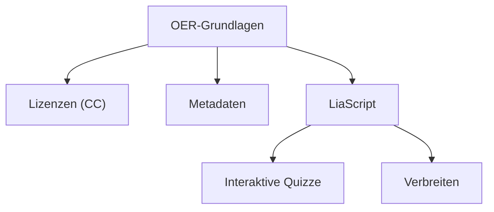

<!--
author:   Sebastian Zug, André Dietrich

email:    sebastian.zug@informatik.tu-freiberg.de

version:  0.1.0

language: de

narrator: Deutsch Male

mode:     Presentation

date:     06/23/2026

comment:  Vertiefung & FAQ zum Workshop "Interaktive OER mit LiaScript erstellen"
          (DHBW, 23.06.2026). Beantwortet die Teilnehmerfragen, die in den
          Phasen 01-04 noch nicht praktisch adressiert wurden — jede an einem
          lauffähigen Beispiel.

repository: https://github.com/LiaPlayground/DHBW_Tutorial_2026

attribute: Interaktive OER mit LiaScript erstellen
           von Sebastian Zug und André Dietrich
           ist lizenziert unter [CC BY-SA 4.0](https://creativecommons.org/licenses/by-sa/4.0/)

import:    https://raw.githubusercontent.com/liaScript/mermaid_template/master/README.md
           https://raw.githubusercontent.com/LiaTemplates/LiveEdit-Embeddings/refs/tags/0.0.1/README.md

link:      style.css

-->

[](https://liascript.github.io/course/?https://raw.githubusercontent.com/LiaPlayground/DHBW_Tutorial_2026/main/05_Vertiefung.md)

# Vertiefung & FAQ — Ihre offenen Fragen

> <h2>Begleitmaterial zum Workshop "Interaktive OER mit LiaScript erstellen"</h2>
>
> <div style="height: 2.5em;"></div>
>
> <h4>Prof. Dr. Sebastian Zug, TU Bergakademie Freiberg</h4>
> <h4>Dr. André Dietrich, TU Bergakademie Freiberg</h4>
>
> <h4>9. Juni 2026</h4>

--------------------------------------------

## Worum geht es hier?

In den Phasen 1–4 haben Sie LiaScript *erlebt*, *verstanden*, *angewendet* und Wege zum *Verbreiten* kennengelernt. In der Fragensammlung im Vorfeld blieben aber einige Fragen offen, die wir hier — kompakt und je an **einem lauffähigen Beispiel** — nachreichen.

> [!NOTE]
> Dieser Kurs ist als **Nachschlagewerk** gedacht: Springen Sie über das Inhaltsverzeichnis (oben links) direkt zu der Frage, die Sie interessiert. Jeder Abschnitt steht für sich.

| #  | Frage                                                              |
| -- | ------------------------------------------------------------------ |
| 1  | Tabellen über Markdown hinaus — Zellen färben und verbinden        |
| 2  | Eigenes Audio einbinden                                            |
| 3  | Podcasts aus externen Quellen einbetten                           |
| 4  | H5P-Inhalte nutzen — und die ehrliche Abgrenzung                  |
| 5  | Templates für ein einheitliches Handbuch                          |
| 6  | Vorhandene Inhalte als Wissensgraph darstellen                    |
| 7  | Hosting — was braucht ein Hochschul-Rechenzentrum?                |
| 8  | Aufwand — was kostet das ehrlich an Zeit?                          |

## 1. Tabellen — Zellen färben und verbinden

> [!TIP]
> **Worum es geht:** Markdown-Tabellen sind bewusst simpel. LiaScript erlaubt darüber hinaus **Styling per HTML-Kommentar** — für die ganze Tabelle *oder* einzelne Zellen.

**Ganze Tabelle stylen** — HTML-Kommentar *direkt über* der Tabelle:

```markdown @embed.style(height: 520px; min-width: 100%; border: 1px black solid)
# Tabelle mit angepasster Breite und Schriftgröße

<!-- style="width: 50%; font-size: 14px;" -->
| Operator | Wirkung      |
| :------- | :----------- |
| AND      | verkleinert  |
| OR       | vergrößert   |
```

**Einzelne Zelle färben** — HTML-Kommentar *am Ende* des Zelleninhalts:

```markdown @embed.style(height: 520px; min-width: 100%; border: 1px black solid)
# Tabelle mit eingefärbten Zellen

| Ampel | Bedeutung                          |
| :---: | :--------------------------------- |
| fertig<!-- style="background:#cdeccd" --> | erledigt   |
| offen<!-- style="background:#f6d6d6" -->  | noch zu tun |
```

> [!NOTE]
> **Zellen verbinden (colspan / rowspan):** Das geht in Markdown-Tabellen *nicht* — hier kommen Sie an eine ehrliche Grenze. Lösung: eine echte HTML-Tabelle, umschlossen von `<lia-keep>`, damit LiaScript das HTML unverändert durchreicht:

```markdown @embed.style(height: 520px; min-width: 100%; border: 1px black solid)
# Verbundene Zellen per HTML-Tabelle

<lia-keep>
<table border="1" cellpadding="6">
  <tr>
    <th>Phase</th>
    <th colspan="2">Aktivität</th>
  </tr>
  <tr>
    <td rowspan="2">Anwenden</td>
    <td>Erste Schritte</td>
    <td>30 min</td>
  </tr>
  <tr>
    <td>Eigenes Material</td>
    <td>40 min</td>
  </tr>
</table>
</lia-keep>
```

## 2. Eigenes Audio einbinden

> [!TIP]
> **Die Faustregel:** Das Fragezeichen `?` steht für das Ohr — also für **Audio**. Es ist die kleine Schwester von `!` (Bild) und `!?` (abspielbares Video).

So binden Sie eine selbst aufgenommene Audiodatei ein — Syntax wie ein Bild, nur mit `?` statt `!`:

```markdown
?[Begrüßung der Lernenden](media/intro.mp3 "Eine kurze Einführung")
```

Das Gleiche funktioniert mit einer öffentlichen URL — hier ein frei abspielbares Beispiel:

?[Beispielton (W3Schools)](https://www.w3schools.com/html/horse.mp3 "ein Pferd")

> [!NOTE]
> **Klartext-Übersicht der vier Medien-Operatoren:**
>
> | Schreibweise | Bedeutung               |
> | ------------ | ----------------------- |
> | ``    | Bild                    |
> | `?[…](…)`    | Audio                   |
> | `!?[…](…)`   | abspielbares Video      |
> | `??[…](…)`   | eingebettete Ressource  |

## 3. Podcasts aus externen Quellen einbetten

> [!TIP]
> **Worum es geht:** Sie müssen einen Podcast nicht herunterladen und neu hosten — viele Plattformen lassen sich direkt einbetten. LiaScript erkennt die Quelle automatisch.

**SoundCloud** wird über das Audio-Zeichen `?` direkt als Player eingebettet:

```markdown
?[Episode von OERinfo](https://soundcloud.com/example/episode)
```

**Andere Plattformen / allgemeine Einbettung** über `??` (versucht zuerst oEmbed, fällt sonst auf ein iframe zurück):

```markdown
??[Podcast-Folge](https://podcast-plattform.de/folge/123)
```

> [!NOTE]
> Ob ein Podcast als Player erscheint, hängt davon ab, ob die Plattform Einbettung erlaubt. Bei Quellen ohne oEmbed-Unterstützung zeigt `??` die Seite im iframe — sofern der Anbieter das Einbetten nicht blockiert.

## 4. H5P-Inhalte nutzen

> [!TIP]
> **Worum es geht:** H5P-Inhalte (interaktive Videos, Dialog Cards, Timelines) lassen sich in LiaScript einbinden — am elegantesten über ein **Template**, das ein exportiertes H5P-Paket lädt.

**Der Template-Weg.** Es gibt ein H5P-Template von André Dietrich (Mitautor von LiaScript). Sie importieren es im Header und rufen dann pro H5P-Inhalt ein Makro auf:

```markdown
<!--
import: https://raw.githubusercontent.com/andre-dietrich/H5P-embed/main/README.md
-->

# Mein Kurs mit H5P

@[h5p_embed](h5p/mein-interaktives-video.html)
```

> [!NOTE]
> Der Parameter ist der Pfad (oder die URL) zu einem **exportierten H5P-Inhalt als `.html`** — das Template lädt ihn per `fetch` in einen Rahmen. In H5P wählen Sie dafür beim Export „Reusable / HTML". Liegt die Datei im selben Repo, reist sie mit Ihrer Quelle mit.

**Ein lauffähiges Beispiel.** Das Template-Repo bringt zwei fertige H5P-Demos mit. Unten ist eine **360°-Virtual-Tour** live eingebunden — öffnen Sie die Vorschau und sehen Sie sich darin um:

```markdown @embed.style(height: 620px; min-width: 100%; border: 1px black solid)
<!--
persistent: true
import:     https://raw.githubusercontent.com/andre-dietrich/H5P-embed/main/README.md
-->

# H5P – 360°-Virtual-Tour

@[h5p_embed](https://raw.githubusercontent.com/andre-dietrich/H5P-embed/main/h5p/virtual-tour-360.html)
```

> [!TIP]
> Eine zweite Demo (ein **Bildvergleich-Slider**, „Image Juxtaposition") liegt unter `h5p/juxt.html` im selben Repo — ersetzen Sie dazu einfach die URL in der letzten Zeile.

**Ein eigenes, nachnutzbares Modul.** So sieht es aus, wenn die `.html` im *eigenen* Repo liegt — hier ein interaktives H5P-Modul „Peer Instruction verstehen" (ein *Interactive Book* mit Wissenschecks und Dialogkarten, CC BY 4.0), das wir nach `Medien/` gelegt haben:


```markdown @embed.style(height: 640px; min-width: 100%; border: 1px black solid)
<!--
import: https://raw.githubusercontent.com/andre-dietrich/H5P-embed/main/README.md
-->

# H5P – Modul „Peer Instruction verstehen"

@[h5p_embed](https://raw.githubusercontent.com/LiaPlayground/DHBW_Tutorial_2026/main/Medien/QUADIS_BLS_PI_Modul3.html)
```

> [!NOTE]
> **Das ist der OER-Idealfall:** Die H5P Datei haben wir mithilfe von [Lumi](https://lumi.education/de/) eine HTML-Datei umgewandelt, die keinen H5P-Player mehr benötigt, sondern direkt im Browser ausgeführt werden kann. Idealerweise liegt diese Datai neben Ihrem Kurs im selben Repository — sie reist mit, ist versioniert und unter CC BY nachnutzbar. Innerhalb des Moduls finden sich interaktive Frage- und Selbsttest-Elemente; so deckt H5P auch quiz-artige Formate ab, die über die nativen LiaScript-Quizze hinausgehen.
>
> *„Modul 3: Peer Instruction verstehen – Grundlagen und Methodik" von Hanna Kubrak, [vhb OER-Portal](https://oer.vhb.org/edu-sharing/components/render/8d2cb682-6d3b-4a7b-aa58-0e26995dfe68), lizenziert unter [CC BY 4.0](https://creativecommons.org/licenses/by/4.0/).*

**Der einfache Weg ohne Template** — für eine schnelle Einbettung einer gehosteten H5P-Seite genügt die eingebettete Ressource `??`:

```markdown
??[Interaktives H5P-Video](https://h5p.org/h5p/embed/617)
```

> [!NOTE]
> **Die Abwägung für OER:**
>
> |                         | LiaScript-Quiz (nativ) | H5P (Template, `.html`)      | H5P (`??`-Embed)  |
> | ----------------------- | ---------------------- | ---------------------------- | ----------------- |
> | **Wo lebt der Inhalt?** | in der Markdown-Datei  | als Datei neben dem Kurs     | auf externem Host |
> | **5V-Freiheiten**       | vollständig            | weitgehend (Datei reist mit) | hängen am Host    |
> | **Offline / dauerhaft** | ja                     | ja                           | nein              |
>
> Vieles, wofür man H5P einsetzt (Multiple-Choice, Lückentext, Drag-the-Words), bilden die **nativen LiaScript-Quizze** ab — und die reisen als Text mit. H5P lohnt sich für Formate, die LiaScript nicht kennt.

## 5. Templates für ein einheitliches Handbuch

> [!TIP]
> **Worum es geht:** Ein Template ist *kein* Designvorlage-Klick wie in Word, sondern ein **importierter Markdown-Baustein** (Makros, CSS, JavaScript). Genau der Hebel für „viele Autor:innen, ein gemeinsamer Look".

**Schritt 1 — ein Makro im Header definieren.** Makros sind Textbausteine mit Platzhaltern (`@0`, `@1`, …):

```markdown @embed.style(height: 420px; min-width: 100%; border: 1px black solid)
<!--
@infobox: <div style="border-left: 4px solid #2E6B3D; background:#E8F0E9; padding: 8px 12px; border-radius: 4px;">@0</div>
-->

# Mein Kapitel

@infobox(Dieser Hinweis-Kasten sieht in **jedem** Kapitel des Handbuchs gleich aus.)

@infobox(Und hier ein zweiter — derselbe Baustein, anderer Inhalt.)
```

> [!NOTE]
> **Einzeiliges Makro** mit Doppelpunkt: `@name: inhalt`. Für mehrzeilige Bausteine gibt es die Block-Form `@name … @end`. Aufgerufen wird ein Makro mit `@name(parameter)`.

**Schritt 2 — gemeinsame Bausteine zentral importieren.** Statt das Makro in jede Datei zu kopieren, legen Sie es in *ein* zentrales Repo und importieren es überall mit einer Zeile:

```markdown
<!--
import: https://raw.githubusercontent.com/IHR-TEAM/handbuch-style/main/README.md
link:   https://raw.githubusercontent.com/IHR-TEAM/handbuch-style/main/style.css
-->
```

> [!IMPORTANT]
> **Das Handbuch-Muster:** Ein Style-Repo + ein Makro-Set = *eine* Quelle für das Design des ganzen Handbuchs. Jede:r Autor:in schreibt dieselbe `import:`-Zeile — ändert sich das zentrale Repo, ändern sich alle Kapitel mit. Fertige Templates zum Anschauen: [github.com/LiaTemplates](https://github.com/LiaTemplates).

## 6. Vorhandene Inhalte als Wissensgraph darstellen

> [!IMPORTANT]
> **Ehrlich vorweg:** Einen automatisch aus Ihren Seiten erzeugten Wissensgraphen gibt es **nicht** als fertiges Feature. Was sehr gut geht: einen Graphen *von Hand* als **Mermaid-Diagramm** zeichnen — inklusive klickbarer Knoten, die zu Kapiteln springen.

**Schritt 1 — das Mermaid-Template im Header importieren.** Ohne diese Zeile sehen Sie unten nur rohen Text statt eines Diagramms:

```markdown
<!--
import: https://raw.githubusercontent.com/liaScript/mermaid_template/master/README.md
-->
```

**Schritt 2 — den Graphen als Code-Block schreiben.** Hinter die öffnenden Backticks kommt `mermaid @mermaid`, darin beschreiben Sie Knoten und Kanten als Text. Mit `click` wird ein Knoten anklickbar:

````markdown

````

**Das Ergebnis** (in diesem Kurs ist der Import bereits gesetzt, daher wird der folgende Block direkt gezeichnet):


> [!NOTE]
> Der `click`-Befehl macht einen Knoten anklickbar — er kann auf eine externe URL oder (mit einem internen Anker wie `#2`) auf eine andere Folie zeigen. So bauen Sie eine handgepflegte „Landkarte" Ihres Handbuchs. Ein echter, automatisch wachsender Wissensgraph bleibt aber außerhalb des LiaScript-Standards.

## 7. Hosting — was braucht ein Hochschul-Rechenzentrum?

> [!TIP]
> **Die Kernbotschaft in einem Satz:** LiaScript braucht **keinen Applikationsserver und keine Datenbank** — ein Kurs ist eine statische Textdatei, die im *Browser der Lernenden* ausgeführt wird.

Was das konkret für ein Rechenzentrum bedeutet:

- **Kein LiaScript-Server.** Der Player ist Open Source und läuft clientseitig. Sie hosten nur die Markdown-Datei (plus ggf. Bilder).

- **Statisches Hosting genügt.** GitHub/GitLab Pages, ein beliebiger WebSpace, ein Nextcloud-Link — alles, was eine Datei per URL ausliefern kann, reicht aus.

- **Minimale Last.** Es gibt keine serverseitige Logik, kein Session-Handling, keine DB-Abfragen. Die Rechenlast (Rendering, Quiz-Auswertung, Code-Ausführung) trägt der Client.

## 8. Aufwand — was kostet das ehrlich an Zeit?

> [!TIP]
> **Ehrliche Einordnung:** Der Aufwand steckt **nicht in der Technik**, sondern im Inhalt. Das ist die gute *und* die unbequeme Nachricht.

**Schnell:** Text, Überschriften, Listen, Tabellen, einfache Quizze — wer Markdown kann (oder die KI nutzt, siehe Phase 4), schreibt das so flüssig wie eine E-Mail.

**Mittel:** Gute Interaktionen *didaktisch sinnvoll* gestalten — durchdachte Quizfragen mit Distraktoren, gestufte Aufdeckung, passende Medien. Hier liegt die eigentliche Arbeit, und die hätten Sie bei *jedem* Werkzeug.

**Unterschätzt:** **Lizenzrecherche und Attribution** für nachgenutzte Medien. Eine korrekte CC-Quellenangabe zu finden und zu prüfen dauert oft länger als das Einbinden selbst.

> [!IMPORTANT]
> **Was Sie NICHT kostet:** Technik-Pflege. Keine Plugin-Updates, keine Server-Wartung, keine Datenbank-Migration. Ein LiaScript-Kurs von heute läuft in fünf Jahren noch — es ist ja nur Text.

## Und damit zurück zum Handbuch

> Alle acht Antworten haben dasselbe Muster: LiaScript nimmt Ihnen die **technische** Last ab, damit Sie sich auf **Inhalt und Didaktik** konzentrieren können. Genau das ist die Voraussetzung dafür, dass viele Autor:innen *gemeinsam* an einem Handbuch arbeiten können — jede:r mit denselben Bausteinen, derselben Quelle, denselben offenen Lizenzen.

> [!NOTE]
> Fehlt Ihnen eine Frage? Ergänzen Sie sie direkt im Repository — per Issue oder Pull Request: [github.com/LiaPlayground/DHBW_Tutorial_2026](https://github.com/LiaPlayground/DHBW_Tutorial_2026/issues).

## Lizenz

Dieses Material steht unter [CC-BY-SA 4.0](https://creativecommons.org/licenses/by-sa/4.0/deed.de).
